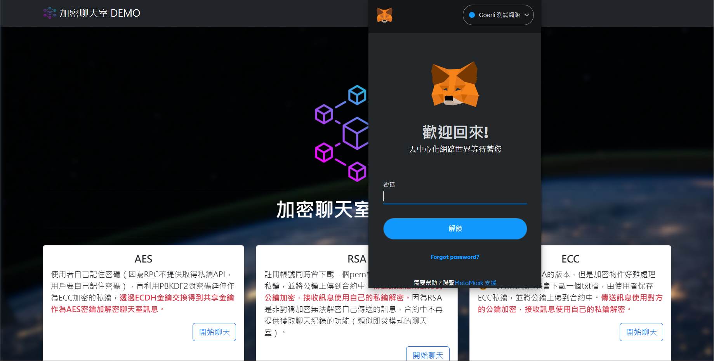
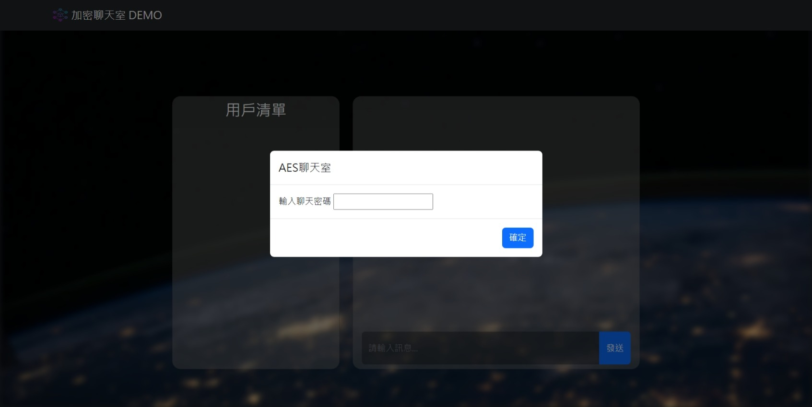

# web-chat

密碼學期末聊天室-三種加密機制(AES、RSA、ECC)

## 簡介

這是一個獨立開發的期末專題，基本要求為加密的聊天室。由於當時稍微接觸到一點 DApp 開發，決定設計最簡單的 DApp架構，前端串接 ABI 的加密聊天室。

## 系統設計

- 前端
  - 利用HTML、CSS、Javascript、Bootstrap、JQuery 設計 UI
  - 利用 ether.js 與智能合約 ABI 互動。
  - `static\javascripts\connect.js` 整合瀏覽器的 Metamask 錢包

- 資料庫
  - 在 Remix IDE 改寫網路上聊天室 Solidity 合約，並部屬到 Ethereum 公有測試鏈 Goerli。

- 後端 & 部屬
  - 在 `server.py` 編寫 Flask 後端框架，並部屬上容器化的部屬平台 Fly.io。

## 說明-加解密實作

1. AES 聊天室 
  使用者自己記住密碼（因為RPC不提供取得私鑰API，用戶要自己記住密碼），再利用PBKDF2對密碼延伸作為ECC加密的私鑰，**透過ECDH金鑰交換得到共享金鑰作為AES密鑰加解密聊天室訊息。**

2. RSA 聊天室 
  註冊帳號同時會下載一個pem檔，由使用者保存RSA私鑰，並將公鑰上傳到合約中。**傳送訊息使用對方的公鑰加密，接收訊息使用自己的私鑰解密。**因為RSA是非對稱加密無法解密自己傳送的訊息，合約中不再提供獲取聊天紀錄的功能（類似即焚模式的聊天室）。

3. ECC 聊天室 
  聊天室設計類似RSA的版本，但是加密物件好難處理😵‍💫。註冊帳號同時會下載一個txt檔，由使用者保存ECC私鑰，並將公鑰上傳到合約中。**傳送訊息使用對方的公鑰加密，接收訊息使用自己的私鑰解密。**

## Demo

- 首頁 & 要求連接錢包

- 聊天室頁面(以AES為例)

## 小記

- chatGPT 出現讓我一個 Web 開發小白決定寫一個網站，從系統設計開始就不斷問 chatGPT，儘管當時底子還不行，最後做出一個不錯的網站。
- 回頭紀錄大三下的做的期末專題，也發現一些當時沒想到的問題：
  - 非對稱密碼沒有使用到 Message Envelope 的概念，直接對訊息加密而導致資源浪費。
  - 尚未有前端概念，胡亂使用 Tag 、 Bootstrap 和 開源的 js 庫，也踩了不少 node.js 的坑。
